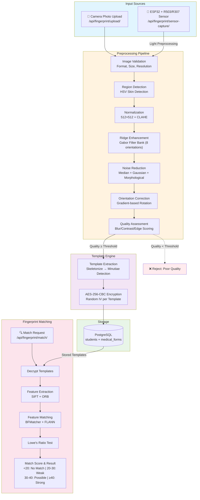

# Walkthrough — Fingerprint Processing & Matching Pipeline

## What Was Built

A complete Django-based biometric pipeline implementing all 22 sections from the engineering specification document.

### Architecture

---

## Files Created (30+ files)

### Project Root
| File | Purpose |
|------|---------|
| [requirements.txt](file:///f:/FingerPrint_sensor/requirements.txt) | Python dependencies (Django, DRF, OpenCV, scikit-image, etc.) |
| [README.md](file:///f:/FingerPrint_sensor/README.md) | Setup guide and API documentation |
| [walkthrough.md](file:///f:/FingerPrint_sensor/walkthrough.md) | Implementation walkthrough |
| [.env](file:///f:/FingerPrint_sensor/.env) | Environment variables (PostgreSQL, encryption key) |
| [.env.example](file:///f:/FingerPrint_sensor/.env.example) | Environment template |
| [.gitignore](file:///f:/FingerPrint_sensor/.gitignore) | Git ignore rules |

### ESP32 Firmware
| File | Purpose |
|------|---------|
| [esp32_as608.ino](file:///f:/FingerPrint_sensor/esp32_as608/esp32_as608.ino) | Arduino sketch for AS608/R503/R307 sensor communication |

### Django Project Configuration
| File | Purpose |
|------|---------|
| [settings.py](file:///f:/FingerPrint_sensor/fingerprint_project/fingerprint_project/settings.py) | Django + PostgreSQL + DRF configuration |
| [urls.py](file:///f:/FingerPrint_sensor/fingerprint_project/fingerprint_project/urls.py) | Root URL configuration |
| [asgi.py](file:///f:/FingerPrint_sensor/fingerprint_project/fingerprint_project/asgi.py) | ASGI entry point |
| [wsgi.py](file:///f:/FingerPrint_sensor/fingerprint_project/fingerprint_project/wsgi.py) | WSGI entry point |
| [manage.py](file:///f:/FingerPrint_sensor/fingerprint_project/manage.py) | Django management script |

### Database Models
| File | Purpose |
|------|---------|
| [models.py](file:///f:/FingerPrint_sensor/fingerprint_project/fingerprint/models.py) | `students` + `medical_forms` tables (exact user schema) |
| [admin.py](file:///f:/FingerPrint_sensor/fingerprint_project/fingerprint/admin.py) | Django admin panels |
| [apps.py](file:///f:/FingerPrint_sensor/fingerprint_project/fingerprint/apps.py) | App configuration |

### API Layer
| File | Purpose |
|------|---------|
| [views.py](file:///f:/FingerPrint_sensor/fingerprint_project/fingerprint/views.py) | All 7 endpoints (upload, sensor-capture, match, students, health, medical-forms) |
| [serializers.py](file:///f:/FingerPrint_sensor/fingerprint_project/fingerprint/serializers.py) | DRF request/response validation |
| [urls.py](file:///f:/FingerPrint_sensor/fingerprint_project/fingerprint/urls.py) | API route configuration |

### Preprocessing Pipeline (8 modules)
| File | Purpose |
|------|---------|
| [validator.py](file:///f:/FingerPrint_sensor/fingerprint_project/fingerprint/preprocessing/validator.py) | Format/size/resolution/finger presence validation |
| [region_detector.py](file:///f:/FingerPrint_sensor/fingerprint_project/fingerprint/preprocessing/region_detector.py) | HSV skin detection + contour crop |
| [normalizer.py](file:///f:/FingerPrint_sensor/fingerprint_project/fingerprint/preprocessing/normalizer.py) | 512×512 resize + CLAHE normalization |
| [ridge_enhancer.py](file:///f:/FingerPrint_sensor/fingerprint_project/fingerprint/preprocessing/ridge_enhancer.py) | Gabor filter bank (8 orientations) |
| [noise_reducer.py](file:///f:/FingerPrint_sensor/fingerprint_project/fingerprint/preprocessing/noise_reducer.py) | Median + Gaussian + morphological operations |
| [orientation.py](file:///f:/FingerPrint_sensor/fingerprint_project/fingerprint/preprocessing/orientation.py) | Gradient-based rotation correction |
| [quality.py](file:///f:/FingerPrint_sensor/fingerprint_project/fingerprint/preprocessing/quality.py) | Blur/contrast/edge quality scoring |
| [pipeline.py](file:///f:/FingerPrint_sensor/fingerprint_project/fingerprint/preprocessing/pipeline.py) | Camera (6-step) and sensor (3-step) orchestrators |

### Template Engine (3 modules)
| File | Purpose |
|------|---------|
| [extractor.py](file:///f:/FingerPrint_sensor/fingerprint_project/fingerprint/templates_engine/extractor.py) | Skeletonize → minutiae detection → binary serialization |
| [encryption.py](file:///f:/FingerPrint_sensor/fingerprint_project/fingerprint/templates_engine/encryption.py) | AES-256-CBC with random IV per template |
| [matcher.py](file:///f:/FingerPrint_sensor/fingerprint_project/fingerprint/templates_engine/matcher.py) | SIFT + ORB + BFMatcher + FLANN with Lowe's ratio test |

### Utilities
| File | Purpose |
|------|---------|
| [logger.py](file:///f:/FingerPrint_sensor/fingerprint_project/fingerprint/utils/logger.py) | Logging utilities |

---

## Verification Results

| Check | Result |
|-------|--------|
| `python manage.py check` | ✅ 0 issues |
| `python manage.py makemigrations` | ✅ Created Student + MedicalForm |
| All module imports | ✅ Successful |

---

## Next Steps (User Action Required)

1. **Update [.env](file:///f:/FingerPrint_sensor/.env)** with your PostgreSQL password and a secure encryption key
2. **Create the database**: `CREATE DATABASE fingerprint_db;`
3. **Run migrations**: `python manage.py migrate`
4. **Create superuser**: `python manage.py createsuperuser`
5. **Start server**: `python manage.py runserver`
6. **Configure ESP32** to POST sensor images to `http://<server>/api/fingerprint/sensor-capture/`
